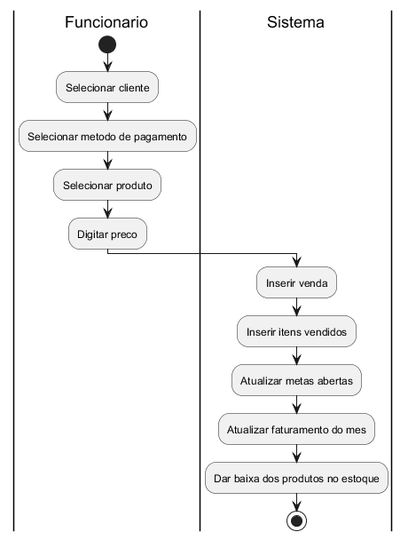

## Diagramas
### Diagrama de caso de uso

### Diagrama de classes

### Diagramas de atividades
#### Criação e finalização de cotação

#### Criação e finalização de meta

#### Cadastro de venda

#### Calculadora do simples

## Levantamento de Requisitos 
#### Requisitos Funcionais: 
1. Cadastro e gerenciamento de produtos: Permite cadastrar, editar e visualizar produtos com informações detalhadas (nome, preço, estoque, etc.). 
2. Cadastro e gerenciamento de clientes e fornecedores: Funções de CRU para clientes e fornecedores, com visualização de informações detalhadas. 
3. Cotação de produtos: Seleção de produtos e fornecedores para gerar cotações. 
4. Controle de estoque: Gerenciamento da quantidade de produtos disponíveis. 
5. Leitura de débitos de clientes: Visualização de débitos dos clientes em sua página de detalhes. 
6. Cadastro de vendas: Registro de vendas com informações de clientes, produtos e valores. 
7. Gráficos e relatórios: Exibição de gráficos de faturamento, gastos e tipos de pagamento. 
8. Sistema de metas: Integração com vendas, atualizando metas com base nas transações realizadas. 
9. Gestão de contas a pagar: Cadastro e visualização das próximas contas da empresa. 
10. Calculadora de Simples Nacional: Cálculo automático dos tributos com base no faturamento.

### Requisitos Não Funcionais:
1.	Segurança Autenticação e Autorização: 
a.	O sistema deve garantir que apenas usuários autenticados possam acessar o sistema. O sistema deve implementar controles de autorização para garantir que os usuários só possam acessar funcionalidades e dados conforme suas permissões. 
b.	Isolamento de Dados: Cada empresa deve ter seu próprio banco de dados para evitar o vazamento de dados entre empresas diferentes. 
2.	Desempenho Tempo de Resposta: 
a.	O sistema deve garantir tempos de resposta rápidos para as operações de leitura e escrita nos bancos de dados. 
3.	Usabilidade Interface Amigável: 
a.	O sistema deve fornecer uma interface de usuário amigável e intuitiva para facilitar o uso por micro e pequenos empreendedores.
4.	Manutenção Facilidade de Manutenção: O sistema deve ser desenvolvido de forma modular para facilitar a manutenção e a adição de novas funcionalidades.

## Programação
### Linguagens utilizadas:
1.	PHP
2.	Javascript
### Frameworks utilizados:
3.	Laravel
4.	Bootstrap
### Ferramentas utilizadas:
1.	Tenancy for Laravel
2.	Datatables
3.	Chart.JS
4.	JQuery
### Banco de dados:
1.	MySQL

### Arquiteturas
2.	Arquitetura MVC
3.	Arquitetura Multi-Tenant
4.	Arquitetura em três camadas

### Software utilizados:
5.	MySQL Workbench
